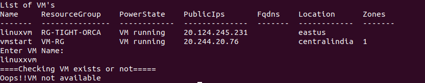
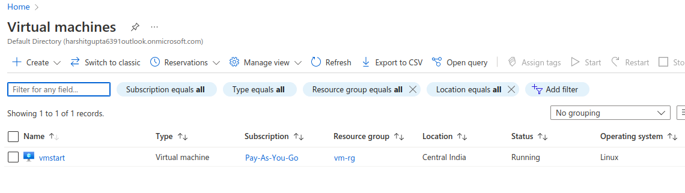

## Description

Here, In this template you will learn how to List and Delete Azure VM using Azurecli.

---

#### Pre-requisite

* AZ Account
* Azure CLI

---

### Steps:-
1. Login into AZ account using `az login` or `az login --tenant <TENANT-ID>`
2. Change the permission of the file `chmod a+x change-vm-state.sh`
3. Go to the terminal and run the command `./list-delete-vm.sh`

---

### Scenarios with Outputs

1. Scenario 1: Where we have mentioned wrong VM to delete :

2. Scenario 2: Where we have mentioned wrong resource group : 

3. Scenario 3: Where we have mentioned correct VM and ResourceGroup names :

4. Before Deleting the VM :

5. After Deleting the VM :

---
